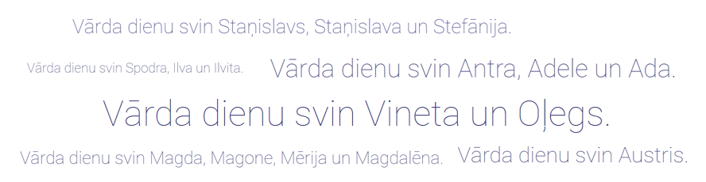

[latvian-state-language-center]: http://vvc.gov.lv/index.php?route=product/category&path=193_199

# Name Days


Name Days in Latvian. 

__Source:__ [Latvian State Language Center][latvian-state-language-center]

## Installation
Clone the repo and cd into it:
```bash
$ git clone https://github.com/vasiljevs/name-days.git

$ cd name-days
```
## Usage

_index.html_
```html
<body>
  <h1 class="heading"></h1>
  <script src="assets/js/app.js"></script>
</body>
```
_assets/js/app.js_
```js
const el = document.querySelector('.heading');
```

## Demo
Preview this project by clicking on link down below.

__URL:__ https://projects.vasiljevs.com/name-days/

## License
Repository is licensed under the [MIT License](LICENSE).
